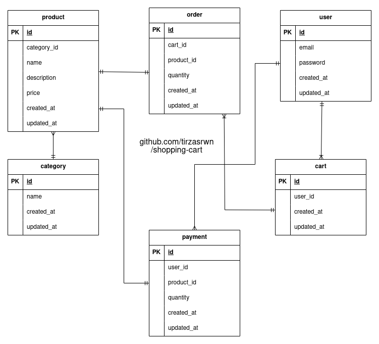
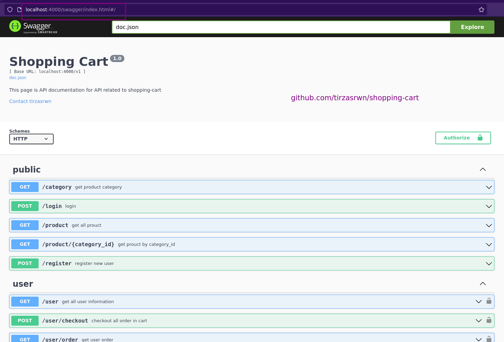

# shopping-cart

## About

A shopping-cart API for case study using go, go-gin, swaggo, and postgresql. Main features for this case studiying are:

- User can view product list by product category
- User can add product to shopping cart
- User can see list of products that have been added to the shopping cart
- User can delete product list in shopping cart
- User can checkout and make payment transactions
- Login and register user

## Stack

- Go
- Gin
- Swagger API Documentation
- JWT
- Postgres
- Database Migration

## Entity Relationship Diagram (ERD)



## Requirement

- Unix based OS (for make command)
- Docker
- Docker Compose
- Make
- Go (for development)

## Running

- Running using docker compose

```sh
git clone https://github.com/tirzasrwn/shopping-cart.git
cd shopping-cart
# start docker compose
make up
# stop docker compose
make down
```

- Running using go command, typically for development

```sh
make start
```

- Running spesific docker image

There are two docker images, backend go and database postgresql.
You can run them separately.

```sh
make docker_<service>_build
make docker_<service>_start
make docker_<service>_stop
# where <service> is db for database and be for backend
```

## API Routes



This API documentaiton using Swagger API documentation. Here are all the routes:

| route                  | method | description                                                                                                            |
| ---------------------- | ------ | ---------------------------------------------------------------------------------------------------------------------- |
| /category              | get    | this is api to get product category                                                                                    |
| /login                 | post   | this is api to authenticate user then returns jwt token                                                                |
| /product               | get    | this is api to get all product                                                                                         |
| /product/{category_id} | get    | this is api to get product by category_id. category_id can be found at /category                                       |
| /register              | post   | this is api to register new user                                                                                       |
| /user                  | get    | this is api to get all user information                                                                                |
| /user/checkout         | post   | this api is to checkout and make payment transactions. total payment can be found at get /user/order                   |
| /user/order            | get    | this api is to get user order                                                                                          |
| /user/order            | post   | this api to post new order or update the quantity. cart_id can be found at /user. prouduct_id can be found at /product |
| /user/order/{order_id} | delete | this api to delete order by order_id. order_id can be found at get /user/order                                         |
| /user/payment          | get    | this api is to get user payment                                                                                        |

Swagger API documentaiton can be found at [http://localhost:4000/swagger/index.html](http://localhost:4000/swagger/index.html).

### Feature and route corelations

- User can view product list by product category
  - use /product/{category_id} route
  - category_id can be found at /category
- User can add product to shopping cart
  - login using /login
  - use post /user/order to create new order or add the quantity
  - cart_id can be found at /user. prouduct_id can be found at /product
- User can see list of products that have been added to the shopping cart
  - login
  - user get /user/order
- User can delete product list in shopping cart
  - login
  - use /user/order/{order_id} to delete
  - order_id can be found at get /user/order
- User can checkout and make payment transactions
  - login
  - user /user/payment to checkout
  - total payment can be found at get /user/order
- Login and register user
  - use /register to create or register new user
  - you need to pass new email and password

## Service Details

- Port

| service name | port |
| ------------ | ---- |
| backend      | 4000 |
| database     | 5432 |

- Credential

  - backend

  ```sh
  email: user1@example.com
  password: user1
  ```

  - database

  ```sh
  username: postgres
  password: postgres
  db name: shopping cart
  ```
